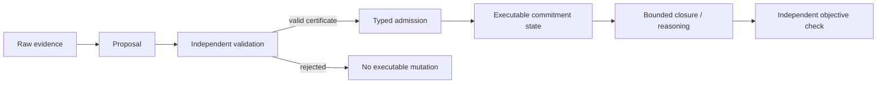

# Starfire Research

**Experimental cognitive architecture research focused on executable state, independently validated inference, and compositional reasoning.**

Starfire Research is the public, sanitized research surface for the private Starfire development repository. It documents the experimental program, frozen claims, negative results, and reproducibility contracts without publishing personal memory stores, deployment secrets, private conversations, or the full private repository history.

> **Status:** active research. Starfire is not AGI, conscious, human-level, or ready for unrestricted autonomous deployment.

## Research question

Most language-model systems preserve context but do not necessarily create durable computational state that changes what later operations can execute. Starfire asks:

> Can a cognitive architecture transform independently validated evidence into typed, executable intermediate state that is causally necessary for later reasoning?

The current research program tests this question through preregistered, deterministic experiments with matched controls, explicit compute budgets, held-out transfer, independent objective checks, and conservative terminal classifications.

## Core architectural hypothesis

The working hypothesis is that **preserved text is not equivalent to executable state**.

Starfire therefore separates:

- immutable observations;
- proposed inferences;
- independently validated certificates;
- typed executable commitments;
- provenance-bearing state transitions;
- bounded downstream execution;
- objective evaluation outside the operation under test.

The central primitive introduced in H9 is **Proof-Carrying Executable Commitment State (PECS)**.



Raw evidence, proof text, confidence scores, and transcripts remain inert unless they survive validation and are admitted as typed executable state.

## Experimental progression

| Experiment | Result | Main finding |
|---|---:|---|
| H4 | Rejected | Memory-associated signal did not justify automatic concept promotion. |
| H5/H5-B | Rejected / diagnostic | Residual identity and task-profiled verification did not establish a stable ontology-induction target. |
| H6 | Rejected | Resolver disagreement did not expose a sufficiently identifiable latent state. |
| H7 | Rejected | State-threaded resolver continuation was largely right-absorbing and did not reveal useful higher-order composition. |
| H8 | Control failure | Unordered internal iteration broke the declared deterministic replay boundary; the scientific verdict was withdrawn rather than rescued. |
| H9 | **Pass** | A validated executable commitment was causally necessary for later fixed-budget composition. |
| H10 | **Pass** | A useful rule could be inferred from target-blind symbolic intervention evidence, independently recomputed, and admitted into PECS. |
| H11 | **Pass** | The candidate relation frontier could be discovered from graph incidence rather than supplied explicitly, while retaining causal controls and independent validation. |

The negative experiments are part of the result. They constrain what the architecture can currently claim and motivated the state-transforming substrate used in H9-H11.

## H9: executable commitment state

H9 introduced a minimal transition language:

```text
CompileWitnessedRule(witness_id, exact_rule)
DeriveFact(rule_commitment_id, support_fact_id)
```

Across 56 roots:

```text
                    training   holdout   future
stateful path          16/16       8/8    32/32
all causal controls      0/*       0/*      0/*
```

The result supports a narrow architectural claim: within the frozen symbolic substrate, a validated same-root operation can create an executable commitment that is causally necessary for a later operation. Text history, scalar history, endpoint execution, invalid mutation, rewired incidence, and delayed admission did not recover the effect.

## H10: evidence-bound rule induction

H10 removed the directly witnessed target bridge. A deterministic proposer scored nine candidate relations over ten intervention episodes. An independent validator recomputed the complete ranking and issued an opaque certificate only when all frozen support, contradiction, score, and margin gates passed.

The valid-but-irrelevant control inferred, validated, and admitted a genuine rule on every root but achieved zero objective successes because the rule did not connect to the held-out objective. This distinguishes successful state mutation from useful state mutation.

## H11: graph-discovered relation frontier

H11 removed H10's developer-supplied 3×3 candidate universe. The mechanism received a mixed symbolic intervention graph and discovered a canonical 6×6 frontier from raw incidence:

```text
24 graph atoms
16 intervention episodes
6 discovered antecedents
6 discovered consequents
36 candidate relations
576 proposal evaluations
576 independent validation evaluations
```

Frozen result:

```text
                                      training  holdout  future
stateful graph-discovered inference      16/16     8/8   32/32
endpoint blind                            0/16     0/8    0/32
proof text only                           0/16     0/8    0/32
scalar only                               0/16     0/8    0/32
foreign proof                             0/16     0/8    0/32
frontier-tampered proof                   0/16     0/8    0/32
valid irrelevant discovery               0/16     0/8    0/32
counterfeit proof                         0/16     0/8    0/32
delayed correct admission                 0/16     0/8    0/32
```

All roots and controls were replayed from fresh state. Budgets, state invariants, proof provenance, and canonical state signatures matched exactly.

## What the results support

The strongest current claim is:

> Under frozen symbolic intervention regimes, Starfire can construct or discover a finite candidate relation frontier, infer an evidence-supported rule, independently recompute the discovery and proof, admit only a validated certificate into typed executable state, and use that state as a causally necessary intermediate for later bounded reasoning across unseen vocabularies.

## What the results do not support

The current program does **not** establish:

- open-world causal discovery;
- natural-language evidence extraction;
- learned representation or ontology formation;
- learned scoring laws or certificate thresholds;
- unrestricted operator invention;
- automatic latent-concept promotion;
- live-routing readiness;
- autonomous self-modification safety;
- AGI, consciousness, or human-level cognition.

## Strongest remaining limitation

H11 removed the explicit candidate relation universe, but the representation and induction laws remain developer-defined. The mechanism still receives symbolically typed episodes, explicit outcome identities, a fixed frontier eligibility rule, a fixed scoring law, fixed certificate thresholds, and finite synthetic graph families.

The next defensible step is **evidence-derived structural abstraction**: learn reusable latent roles or relation classes from graph motifs across training roots, require those learned abstractions to generate candidate executable relations on held-out and future graph families, and preserve H9-H11's matched-budget controls and independent validation.

## Repository policy

This public surface is intentionally separated from the private development repository.

Published here:

- frozen research summaries;
- preregistration and evaluation contracts;
- claim boundaries;
- architecture descriptions;
- sanitized reference implementations after review;
- reproducibility instructions and result manifests.

Not published here:

- SQLite identity or memory stores;
- user conversations or personal data;
- credentials, deployment secrets, or private endpoints;
- unreviewed private repository history;
- generated artifacts containing sensitive state;
- claims stronger than the experiments support.

## Contents

- [`docs/RESEARCH_PROGRAM.md`](docs/RESEARCH_PROGRAM.md) — experimental method and progression
- [`docs/CLAIM_BOUNDARIES.md`](docs/CLAIM_BOUNDARIES.md) — exact supported and unsupported claims
- [`docs/RESULTS.md`](docs/RESULTS.md) — H9-H11 frozen result summary
- [`docs/PUBLICATION_POLICY.md`](docs/PUBLICATION_POLICY.md) — sanitization and release rules
- [`SECURITY.md`](SECURITY.md) — private disclosure guidance
- [`CITATION.cff`](CITATION.cff) — citation metadata

## Author

**Zachary Maronek**

## License

Documentation in this public research surface is released under the MIT License unless a file states otherwise. Private Starfire materials are not implicitly licensed by this repository.
